# Customer-Churn-Analysis
## Project Workflow
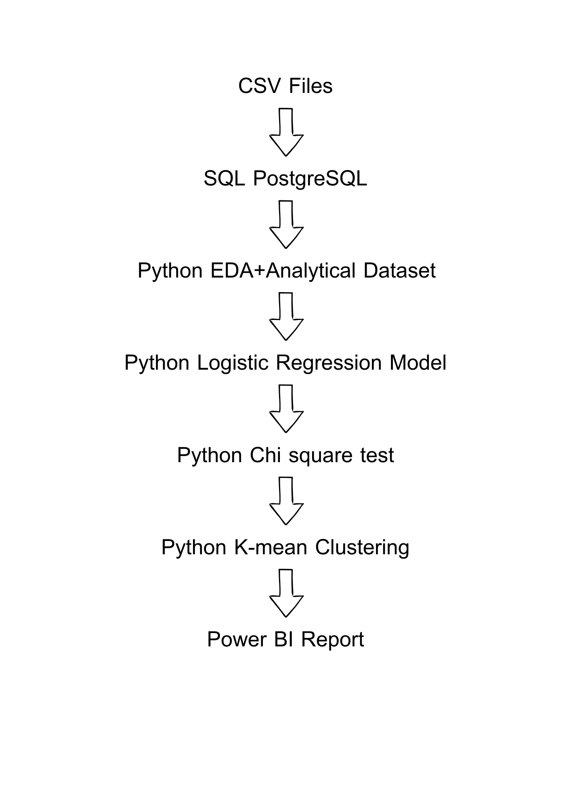
## Project Overview
This project aims to predict customer default risk and identify the key drivers behind loan defaults.
## Dataset 
* credit_score (num)(independent variable)
* country (nominal catagorical)(independent variable)
* gender (nominal catagorical)(independent variable)
* age (num)(independent variable)
* tenure (ordinal catagorical)(independent variable)
* balance (num)(independent variable)
* products_number (num)(independent variable)
* credit_card (nominal catagorical)(independent variable)
* active_member (nominal catagorical)(independent variable)
* estimated_salary (num)(independent variable)
* churn (target variable)
## Exploratory Data Analysis
### Distribution Analysis
#### Credit Score
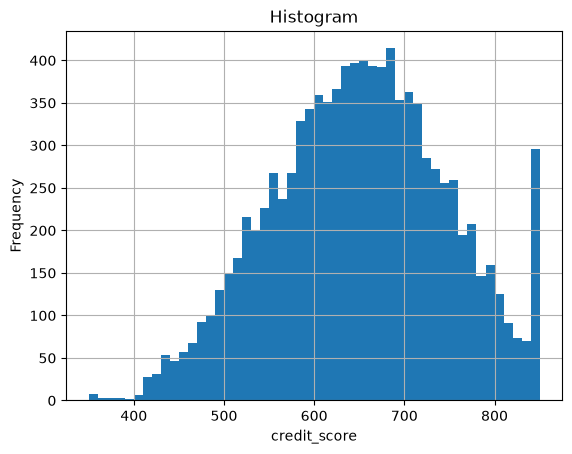
#### Age
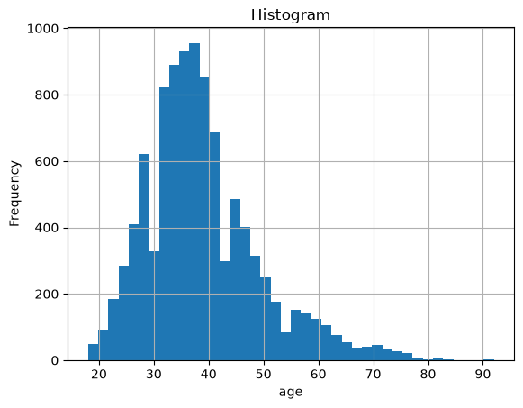
#### Tenure
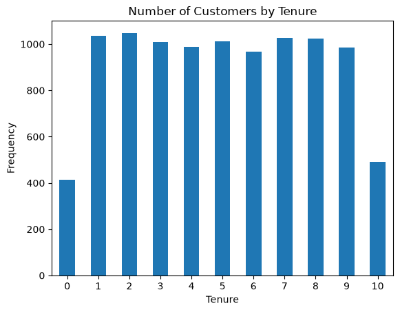
#### Balance
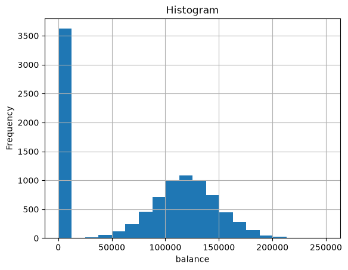
#### Estimated Salary
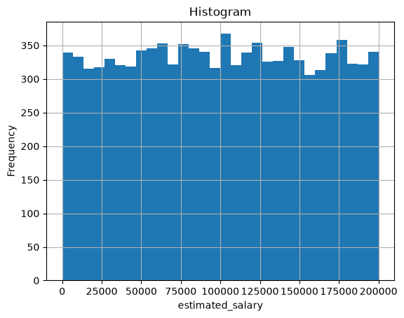
#### Finding from distribution analysis
* Credit score histogram is like a bell curve that has concentrated point ~680-690 and has a tall rightest tail which represent a group of person who got full score.
* Hightest age range of customer is 36-38 years old and age histrogram is right screw with mean we need to take a log before performing on logistic regression model.
* Two lowest tenure age are 0 and 10 yaers(each of them is 4-5% of all) and each of the remaining tenure age is around 10%.
* After plot a net worth balance histogram, seperating between two group. First group is a zero networth account estimated 36% and second group is a account that has more than zero networth balance look like a bell curve which has highest point around 120k.
* Estimated salary histogram indicates that at all range of salary contain a similar number of account inside it.
### Default Rate Analysis
#### Credit Score
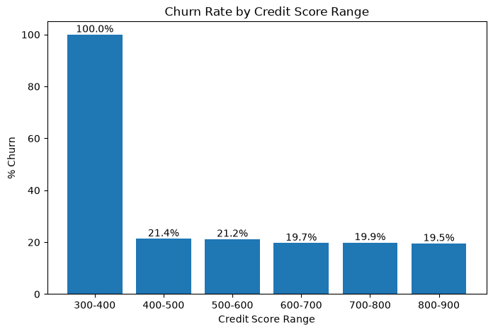
#### Age
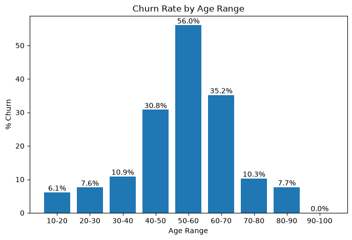
#### Tenure
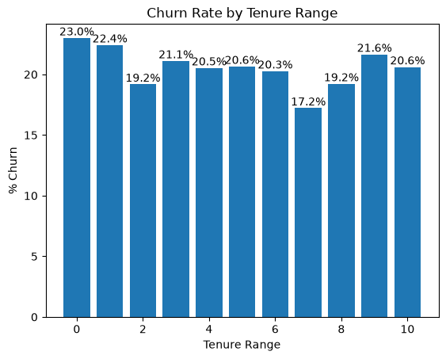
#### Balance
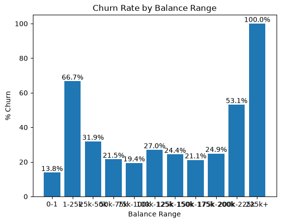
#### Products Number
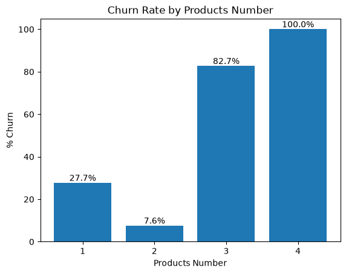
#### Active Member
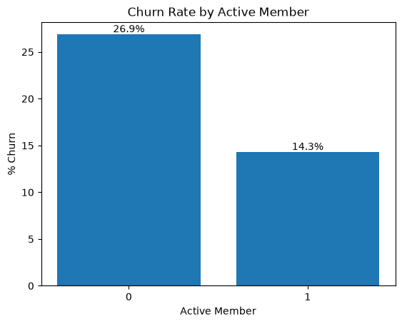
#### Finding from Default Rate Analysis
* From credit score range, the highest churn rate is credit score range between 300-400 which reach churn rate 100% but we has seen that a sample point of this group is only 0.19% or 19 persons. Meanwhile, others range is contain a similar churn rate at around 20%.
* Churn rate graph by age range range show us a bell curve histogram. The highest churn rate is age range between 50-60 which reach 56% churn rate.
* From churn rate graph by tenure, look like not much different between each tenure age. The hishest churn rate is 0 yaer at 23.0% and lowest is 7 year at 17.2%.
* We will devide a balance net worth into two groups. Fist group balance eqaul to 0 has churn rate at 13.8%. Second group is an account that balance higher than 0, this group churn rate at two tail in right and left side have higher churn rate than remaining balance range but should be careful that a two tail(<25k and >225k)are very small sample number.
* A number of product that contain highest churn rate is 4 which 100% churn rate but also smallest group of total member 0.6% or 60 person. Second 3 product number at 82.71% churn rate. Third is 1 product number at 27.71% churn rate and lastly is 2 product number at 7.58% churn rate.
* A active member churn rate is only 14.3% meanwhile inactive member higher than active member almost 2 times at 26.9%.
### Correlation Analysis
#### Variance Inflation Factor
| Feature | VIF |
|---|---:|
| country_france | 1.508787 |
| country_germany | 1.724125 |
| gender | 1.003156 |
| log_age | 1.009108 |
| tenure | 1.001958 |
| balance | 1.336363 |
| products_number | 1.122079 |
| credit_card | 1.001557 |
| active_member | 1.006689 |
| estimated_salary | 1.000925 |
#### Finding from correlation analysis
Each of feature's variance inflation factor value indicate that thare are very small effect contributes from each others feature. So, we will keep all features to develop our model.
## Modeling : Logistic Regression
The model was evaluated using a confusion matrix, classification report, ROC-AUC score and logistic regression results table by choosing threshold at 0.60

### Confusion Matrix

|              | Predicted 0 | Predicted 1 |
| ------------ | ----------: | ----------: |
| **Actual 0** |          1339 |          254 |
| **Actual 1** |           175 |          232 |

### Classification Report

| Class            | Precision | Recall | F1-score | Support |
| ---------------- | --------: | -----: | -------: | ------: |
| **0**            |      0.88 |   0.84 |     0.86 |      1593 |
| **1**            |      0.48 |   0.57 |     0.52 |      407 |
| **Macro Avg**    |      0.68 |   0.71 |     0.69 |     2000 |
| **Weighted Avg** |      0.80 |   0.79 |     0.79 |     2000 |

### Overall Performance

| Metric       |      Score |
| ------------ | ---------: |
| **Accuracy** |       0.7855 |
| **ROC-AUC**  | **0.7728** |

We find a threshold by calculated an expected cost by minimize a sum of campaign cost, churn loss cost and campaign failure. By assuming each cost of value we got a minimimum expected cost at threshold equals to 0.60 .

For **Class 1**, the model has a recall of **0.57**, meaning that it moderately identifies a positive cases. Its precision is also closely at **0.48, indicating that a half number of class 1 predicted is false positives.
For **Class 0**, the model has high precision (**0.88**) and also high recall (**0.84**), meaning that both of its predictions of Class 0 are usually correct.
Overall, the model appears to prioritize detecting **Class 0** over minimizing false positives.

### Logistic Regression Results Table
| Variable | coef | std err | z | P value | [0.025 | 0.975] |
|---|---:|---:|---:|---:|---:|---:|
| const | -1.6984 | 0.036 | -47.514 | 0.000 | -1.769 | -1.628 |
| credit_score | -0.0570 | 0.030 | -1.875 | 0.061 | -0.117 | 0.003 |
| country_france | -0.0160 | 0.040 | -0.405 | 0.685 | -0.093 | 0.061 |
| country_germany | 0.3077 | 0.038 | 8.020 | 0.000 | 0.233 | 0.383 |
| gender | -0.2683 | 0.030 | -8.811 | 0.000 | -0.328 | -0.209 |
| log_age | 0.8813 | 0.034 | 26.094 | 0.000 | 0.815 | 0.948 |
| tenure | -0.0305 | 0.030 | -1.008 | 0.314 | -0.090 | 0.029 |
| balance | 0.1699 | 0.036 | 4.739 | 0.000 | 0.100 | 0.240 |
| products_number | -0.0396 | 0.030 | -1.299 | 0.194 | -0.099 | 0.020 |
| credit_card | 0.0037 | 0.030 | 0.123 | 0.902 | -0.056 | 0.063 |
| active_member | -0.5231 | 0.032 | -16.279 | 0.000 | -0.586 | -0.460 |
| estimated_salary | 0.0068 | 0.031 | 0.222 | 0.824 | -0.053 | 0.067 |

#### Finding from p-value
A significant of coefficient can indicate by a p-value, a less number of p-value indicate a probability of coefficent value will eqauls to zero is very less. Mostly, we use a standard number to decide which feature coefficient is significant or not at 0.05. From a p-value matrix above, five featurs were count to be significance there are country_germany, gender, gender, log_age and active_member. 

### Churn Rate with Probability Band Table
| No. | Probability Band | Customers | Actual Churn | Churn Rate (%) |
|---:|:---:|---:|---:|---:|
| 0 | 0.00–0.05 | 16 | 0 | 0.00 |
| 1 | 0.05–0.10 | 72 | 2 | 2.78 |
| 2 | 0.10–0.15 | 129 | 5 | 3.88 |
| 3 | 0.15–0.20 | 150 | 14 | 9.33 |
| 4 | 0.20–0.25 | 168 | 11 | 6.55 |
| 5 | 0.25–0.30 | 139 | 14 | 10.07 |
| 6 | 0.30–0.35 | 156 | 18 | 11.54 |
| 7 | 0.35–0.40 | 156 | 20 | 12.82 |
| 8 | 0.40–0.45 | 144 | 15 | 10.42 |
| 9 | 0.45–0.50 | 149 | 22 | 14.77 |
| 10 | 0.50–0.55 | 121 | 28 | 23.14 |
| 11 | 0.55–0.60 | 114 | 26 | 22.81 |
| 12 | 0.60–0.65 | 101 | 38 | 37.62 |
| 13 | 0.65–0.70 | 90 | 31 | 34.44 |
| 14 | 0.70–0.75 | 71 | 38 | 53.52 |
| 15 | 0.75–0.80 | 85 | 34 | 40.00 |
| 16 | 0.80–0.85 | 70 | 38 | 54.29 |
| 17 | 0.85–0.90 | 43 | 33 | 76.74 |
| 18 | 0.90–0.95 | 21 | 16 | 76.19 |
| 19 | 0.95–1.00 | 5 | 4 | 80.00 |

#### Determine customer segment by risk level
From above table, we can seperate a customer segment by observe an increaseing rate of churn rate on each probability band. We determine Low risk at 0.00-0.25, Medium risk at 0.25-0.50 and high risk at 0.50-1.00. 

## Statistical-test : Chi-Square Test

### Results Table
| Feature | Chi-square | p-value | df | Cramer's V | Min Expected | % Expected < 5 | p-adjusted | Significant |
|---|---:|---:|---:|---:|---:|---:|---:|:---:|
| country | 301.255337 | 3.830318e-66 | 2 | 0.173567 | 504.5649 | 0.0 | 1.532127e-65 | True |
| gender | 112.918571 | 2.248210e-26 | 1 | 0.106263 | 925.4091 | 0.0 | 4.496420e-26 | True |
| credit_card | 0.471338 | 4.923724e-01 | 1 | 0.006865 | 599.8965 | 0.0 | 4.923724e-01 | False |
| active_member | 242.985342 | 8.785858e-55 | 1 | 0.155880 | 987.7413 | 0.0 | 2.635757e-54 | True |

#### Finding from Chi-Square test
After review a p-value and p-adjusted value of country, gender and active member are statistical significant for churn effect.

## Customer Segmentation : K-mean Clustering

First, we consider about a correlation between each variables before choose a variable to make a a K-mean Clustering. As a result above in EDA part, there no correlation between them.

### Skewness of each variables
| Variable | Skewness |
|---|---:|
| age | 1.011320 |
| products_number | 0.745568 |
| tenure | 0.010991 |
| estimated_salary | 0.002085 |
| credit_score | -0.071607 |
| balance | -0.141109 |

From table above, we consider to take a log on age variable to decrease an effect from scaling.

### Elbow Method
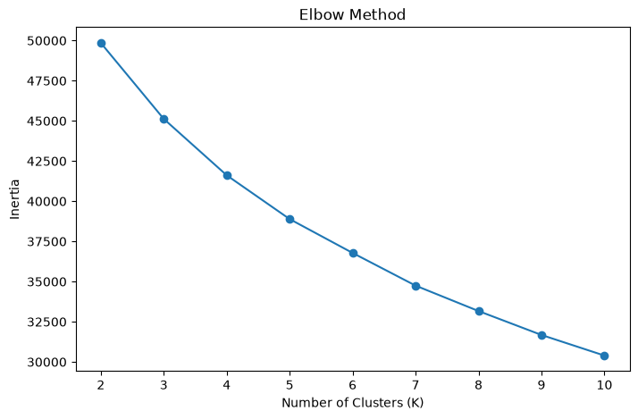

From above graph, we try to find out a number of clusters that a value of inertia not significantly reducing when increase a number of clusters. However,  elbow method isn't clear.

### Silhouette Score
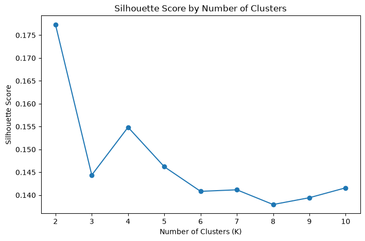

The highest Silhouette Score is K=2. However, we will look at a business interpretation on each number of K before decisions.

### Amount of Member on each Number of Clusters

K=2
| Cluster | Number of Customers |
|---:|---:|
| 0 | 4207 |
| 1 | 5793 |

K = 3
| Cluster | Number of Customers |
|---:|---:|
| 0 | 3199 |
| 1 | 3494 |
| 2 | 3307 |

K = 4
| Cluster | Number of Customers |
|---:|---:|
| 0 | 2132 |
| 1 | 2419 |
| 2 | 2965 |
| 3 | 2484 |

K = 5
| Cluster | Number of Customers |
|---:|---:|
| 0 | 1868 |
| 1 | 2182 |
| 2 | 1999 |
| 3 | 2157 |
| 4 | 1794 |

At all of number of clusters show us an appropriate separated.

### Cluster Profiling by Variable STD on each Number of Clusters.

K = 3
| Cluster | credit_score | log_age | tenure | balance | products_number | estimated_salary |
|---:|---:|---:|---:|---:|---:|---:|
| 0 | -0.02 | 0.05 | 0.90 | 0.58 | -0.44 | 0.11 |
| 1 | 0.01 | -0.10 | 0.04 | -1.03 | 0.82 | -0.01 |
| 2 | 0.00 | 0.06 | -0.92 | 0.53 | -0.45 | -0.09 |

K = 4
| Cluster | credit_score | log_age | tenure | balance | products_number | estimated_salary |
|---:|---:|---:|---:|---:|---:|---:|
| 0 | 0.02 | -0.01 | -0.01 | 0.73 | 1.02 | 0.05 |
| 1 | 0.08 | 0.11 | 0.89 | 0.45 | -0.91 | 0.01 |
| 2 | 0.00 | -0.15 | 0.04 | -1.21 | 0.77 | -0.03 |
| 3 | -0.10 | 0.09 | -0.90 | 0.39 | -0.91 | -0.03 |

K = 5
| Cluster | credit_score | log_age | tenure | balance | products_number | estimated_salary |
|---:|---:|---:|---:|---:|---:|---:|
| 0 | -0.01 | -0.01 | -0.02 | -1.15 | 0.51 | -0.93 |
| 1 | 0.04 | 0.15 | 0.87 | 0.64 | -0.91 | 0.02 |
| 2 | 0.03 | 0.01 | -0.02 | 0.77 | 1.04 | 0.06 |
| 3 | -0.07 | -0.02 | -0.92 | 0.60 | -0.91 | -0.02 |
| 4 | 0.01 | -0.17 | 0.08 | -1.16 | 0.52 | 0.90 |

Three variables that can use to separate cluster there are tenure, balance and product number. At K=3 and 4 are easy to do a customer profiling and business interpretation.

### Churn Rate on each Number of Clusters.

K = 2
| Cluster | Customers | Churn Rate (%) |
|---:|---:|---:|
| 0 | 4207 | 17.38 |
| 1 | 5793 | 22.54 |

K = 3
| Cluster | Customers | Churn Rate (%) |
|---:|---:|---:|
| 0 | 3199 | 22.82 |
| 1 | 3494 | 14.17 |
| 2 | 3307 | 24.55 |

K = 4
| Cluster | Customers | Churn Rate (%) |
|---:|---:|---:|
| 0 | 2132 | 21.34 |
| 1 | 2419 | 27.16 |
| 2 | 2965 | 7.35 |
| 3 | 2484 | 28.46 |

K = 5
| Cluster | Customers | Churn Rate (%) |
|---:|---:|---:|
| 0 | 1868 | 12.90 |
| 1 | 2182 | 26.35 |
| 2 | 1999 | 22.51 |
| 3 | 2157 | 25.82 |
| 4 | 1794 | 11.93 |

From the tables above, at number of clusters equals to 4 shows clearly separated churn rate to three different level.

### Conclusion
K=4 provides the best balance between statistical structure, customer profile differentiation, cluster balance, and churn-based business interpretability.

